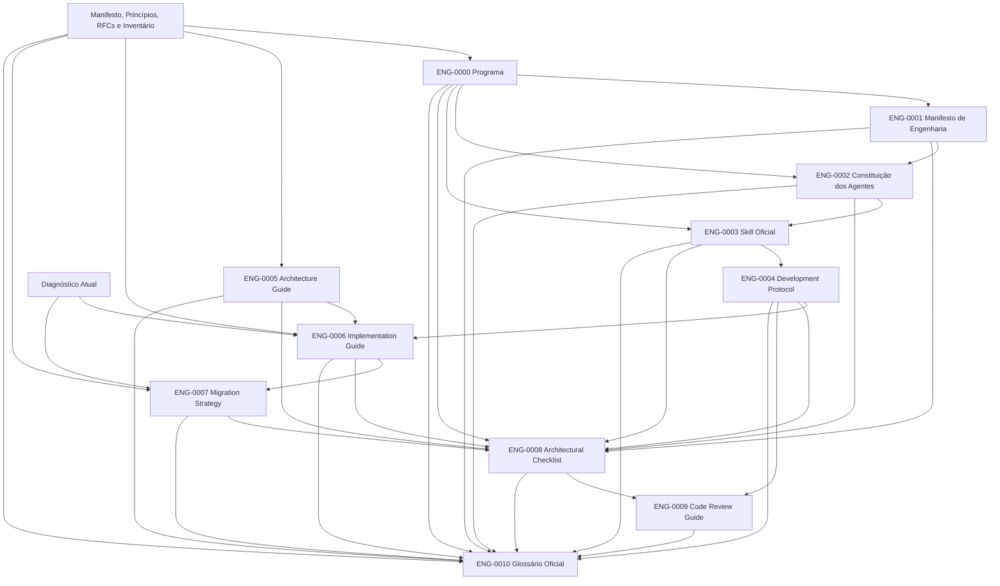

# Mapa de Dependências da Série ENG

**Data:** 01/08/2026

## Dependências normativas externas

- ENG-0005 depende de RFCs e Inventário.
- ENG-0006 depende de RFCs e Diagnóstico.
- ENG-0007 depende de Diagnóstico e RFCs.
- ENG-0010 depende de todas as RFCs existentes.

## Dependências bloqueadas ou incompletas

- RFC-0015 está aprovada e RFC-0016 está recebida como Draft 0.1 em `docs/RFC-0016-Governanca-da-IA-Autonomia-e-Autoridade-Humana.md`; ambas permanecem fontes com escopo próprio e não tornam a IA obrigatória.
- RFC-0002 e RFC-0003 a RFC-0011/RFC-0013 aguardam aprovação explícita conforme seus próprios metadados.
- A numeração da RFC-0012 foi corrigida; seu conteúdo normativo detalhado ainda precisa ser elaborado.
- O baseline executa Ruff e mypy por `tools/quality.ps1`.
- A descoberta padrão do Django encontra e executa quatro testes de caracterização do domínio de pedidos.

Essas lacunas propagam `COMPLETED_WITH_GAPS`, sem invalidar as responsabilidades procedurais dos ENGs.
